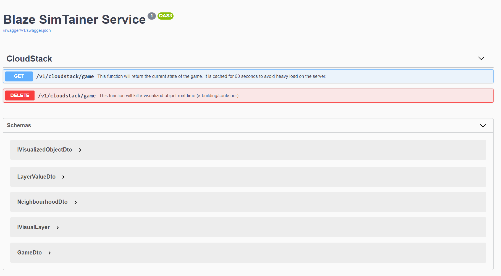

# Blaze SimTainer Service

The API behind the SimTainer game.

## 1. Getting started

### 1.1. Installation

To build/compile this application you must install Visual Studio or any other IDE that support .NET Core 3.1.

If you want to run the application, the easiest way to do this is just to *Dockerize* the application.
Read more information here: <https://docs.microsoft.com/en-us/dotnet/core/docker/build-container>.

You can also download the latest release from the releases tab and run the executable.

**If you run/build/compile this application you must set the base URLs of Mesos, Prometheus and Marathon in the `appsettings.json`.**

Mesos is the only mandatory application to let this application work for now, if you leave Marathon or the Prometheus endpoint blank, the building sizes and layers are not functioning as supposed to be, but the game will still work.

### 1.2. Swagger

This application uses Swagger for API documentation.
If you set your run environment to Development or Local it should enable the Swagger documentation. If you browse to your local webserver and go to the endpoint `/swagger/index.html` you should see Swagger.

The behaviour of the delete endpoint is to kill a Docker container through Marathon.


### 1.3. SignalR

This application uses SignalR for communication between the game and the server to send real-time updates.
SignalR is not documented in the Swagger documentation.
The current endpoint for the existing SignalR Hub is `/hubs/cloudstack/game`.

The model for event updates is as followed:
You don't need to fill every key. Only the values you want to update.

```jsonc
{
  "neighbourhoodName": "authorisation-service",
  "addedNeighbourhood": {
    "name": "authorisation-service-v2",
    "visualizedObjects": [],
    "layerValues": [
      {
        "layerType": "cpuLayer",
        "maxValue": 100,
        "minValue": 0
      },
      {
        "layerType": "memoryLayer",
        "maxValue": 500,
        "minValue": 0
      }
    ],
    "daysOld": 95,
    "team": "authorisation-developers"
  },
  "removedNeighbourhood": "IDENTIFIER-OF-NEIGHBOURHOOD",
  "addedVisualizedObject": {
          "type": "staging-building",
          "size": 7,
          "layerValues": null,
          "identifier": "011774df-0af3-4ff4-9672-f3bd16de5fc2"
  },
  "removedVisualizedObject": "IDENTIFIER-OF-A-BUILDING",
  "updatedLayerValues": {
    "IDENTIFIER-OF-A-BUILDING": {
      "cpuLayer": 0.1,
      "memoryLayer": 0.5,
    }
  },
  "updatedNeighbourhood": {
      "name": "search-service",
      "visualizedObjects": [],
      "layerValues": [],
      "daysOld": 150,
      "team": "search-developers"
  },
  "updatedVisualizedObjects": [{
          "type": "staging-building",
          "size": 7,
          "layerValues": null,
          "identifier": "011774df-0af3-4ff4-9672-f3bd16de5fc2"
        },
        {
          "type": "staging-building",
          "size": 7,
          "layerValues": null,
          "identifier": "12345678-0af3-4ff4-9672-f3bd16de5fc2"
        }
  ]
}
```

## 2. Development

### 2.1. Introduction

The game was intended to be extendable. This is why there has been chosen for an agreement (Data transfer objects) between the back end and the game.

The endpoint `/v1/cloudstack/game` looks for example like the following:

```jsonc
{
  "neighbourhoods": [
    {
      "name": "authorisation-service",
      "visualizedObjects": [
        {
          "type": "building",
          "size": 7,
          "layerValues": {
            "memoryLayer": 434,
            "cpuLayer": 6.8
          },
          "identifier": "598af9be-7f40-46eb-8e3e-5059183396ac"
        },
        {
          "type": "building",
          "size": 7,
          "layerValues": {
            "memoryLayer": 434,
            "cpuLayer": 5
          },
          "identifier": "94f0fdb1-6dfe-4e92-afce-6a99fb774870"
        }
      ],
      "layerValues": [
        {
          "layerType": "cpuLayer",
          "maxValue": 100,
          "minValue": 0
        },
        {
          "layerType": "memoryLayer",
          "maxValue": 500,
          "minValue": 0
        }
      ],
      "daysOld": 95,
      "team": "authorisation-developers"
    },
    {
      "name": "search-service",
      "visualizedObjects": [
        {
          "type": "building",
          "size": 7,
          "layerValues": {
            "memoryLayer": 499,
            "cpuLayer": 3.1
          },
          "identifier": "9f9180d9-5452-44cb-be86-019798213cf4"
        },
        {
          "type": "building",
          "size": 7,
          "layerValues": {
            "memoryLayer": 499,
            "cpuLayer": 3.1
          },
          "identifier": "011774df-0af3-4ff4-9672-f3bd16de5fc2"
        }
      ],
      "layerValues": [
        {
          "layerType": "cpuLayer",
          "maxValue": 100,
          "minValue": 0
        },
        {
          "layerType": "memoryLayer",
          "maxValue": 500,
          "minValue": 0
        }
      ],
      "daysOld": 150,
      "team": "search-developers"
    }
  ],
  "layers": [
    {
      "icon": "images/cpu_icon.png",
      "layerType": "cpuLayer"
    },
    {
      "icon": "images/ram_icon.png",
      "layerType": "memoryLayer"
    }
  ],
  "teams": [
    "authorisation-developers",
    "search-developers"
  ]
}
```

### 2.2. Providers

Let's call external API's providers. Every provider can give some information that we can use.
For example, we used Marathon, Mesos and Prometheus for this application.

* Mesos - Provides real-time event updates and initialization of the application data.
* Marathon - Provides information about the age of a container so we can let a building look decayed if older than a threshold.
* Prometheus - Provides the metrics of containers. So, we know what buildings are on fire (CPU, RAM > 90%)

To add a new provider, you can simply add a new providers project.
There is a shared providers project with default interfaces and models. Every application should be an `IApplication`, every instance (docker container for example) should be an `IInstance` and every metric should be an `IMetric`.

### 2.3. Add a new provider

The main application only knows things about `IApplications`, `IInstances` and `IMetrics` for the converter to work.
To convert the data to the right format you should implement the `IDataConverter` class.

You can send any object to the main application, why? Because the game doesn't know anything about applications, instances or metrics because it is extendable.

It only knows Neighbourhoods, VisualizedObjects and Layers.
The only thing required from a DataConverter is a way of generating a game dto. It is not required to generate update events, because in some cases it is possible there are no updates.

If you added your provider project it is important to add the provider to the `ApiCollectorService`.
The `ApiCollectorService` is responsible for all the polling and handling event updates.

## 3. Layers

A Layer can be anything that is a metric. From CPU metrics to ordered products in a warehouse.
Layers have a min and max value so we can calculate percentages.
Layers are handled in the data converter class.

## 4. Testing

There are unit tests written for the CloudStack provider project and the API project.

## 5. Developer note

This project is a graduation project. If you have any questions, feedback or suggestions, feel free to contact us (Harm Weites, Sebastiaan Bekker or Leroy van Dijk)!

## 8. Icons

Icons used in this project are from iconfinder.com created by DesignerzBase.
